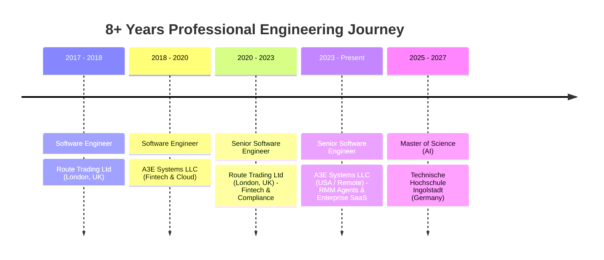

# Hi there, I'm Sharjeel Qasim 👋

[;6x+Microsoft+Certified+Professional;.NET+%E2%80%A2+Azure+%E2%80%A2+React.js+%E2%80%A2+AI;Distributed+Systems+%26+Cloud+Architect;M.Sc.+Applied+AI+%40+THI+Germany)](https://git.io/typing-svg)

  
  &nbsp;&nbsp;
  
  &nbsp;&nbsp;
  

---

### 👨‍💻 Executive Summary

Full Stack Senior Software Engineer & Cloud Architect with **8+ years of industry experience** building and shipping robust web applications, high-concurrency microservices, and distributed cloud systems across **fintech, cloud services, RMM infrastructure, CRM platforms, booking applications, and social media automation tools**. 

Currently pursuing a **Master's Degree in Applied Artificial Intelligence** at **Technische Hochschule Ingolstadt (THI)** in Germany, specializing in bridging enterprise software engineering (.NET, React, Azure) with production AI agent frameworks, Large Language Models (LLMs), and Microsoft Foundry solutions.

- 🔭 **Current Role**: Senior Software Engineer at **A3E Systems LLC** (architecting custom RMM agents, secure identity management, distributed monitoring/alerting, and enterprise SaaS platforms).
- 📍 **Location**: Ingolstadt / Greater Munich Area, Bavaria, Germany 🇩🇪 *(Open to Hybrid / Remote roles in Germany & EU)*.
- ⚡ **Engineering Principles**: Clean Architecture, Domain-Driven Design (DDD), CQRS, Event-Driven Architectures, Zero-Downtime CI/CD, and Zero Trust security.

---

### 🏆 6x Microsoft Certified & Technical Credentials

  

 

<table>
  <tr>
    <td width="50%" valign="top">
      <h4>🤖 Microsoft Certified: Azure AI Engineer Associate</h4>
      
<b>Code:</b> AI-102 &nbsp;|&nbsp; <b>Issuer:</b> Microsoft

      
<i>Building, managing, and deploying AI solutions using Azure OpenAI, Cognitive Services, NLP, Computer Vision, and Microsoft Foundry.</i>

    </td>
    <td width="50%" valign="top">
      <h4>💻 Microsoft Certified: Azure Developer Associate</h4>
      
<b>Code:</b> AZ-204 &nbsp;|&nbsp; <b>Issuer:</b> Microsoft

      
<i>Designing, building, testing, and maintaining cloud applications, Azure Functions, App Services, Cosmos DB, and secure API integrations.</i>

    </td>
  </tr>
  <tr>
    <td width="50%" valign="top">
      <h4>🔒 Microsoft Certified: Security, Compliance & Identity</h4>
      
<b>Code:</b> SC-900 &nbsp;|&nbsp; <b>Issuer:</b> Microsoft

      
<i>Zero Trust architecture, Microsoft Entra ID, Microsoft Sentinel SIEM/SOAR, Microsoft Defender XDR, and Purview compliance solutions.</i>

    </td>
    <td width="50%" valign="top">
      <h4>☁️ Microsoft Certified: Azure Data Fundamentals</h4>
      
<b>Code:</b> DP-900 &nbsp;|&nbsp; <b>Issuer:</b> Microsoft

      
<i>Relational (Azure SQL, Managed Instance), Non-Relational (Cosmos DB, Blob/Table), Synapse analytics, ADF, and Power BI.</i>

    </td>
  </tr>
  <tr>
    <td width="50%" valign="top">
      <h4>🧠 Microsoft Certified: Azure AI Fundamentals</h4>
      
<b>Code:</b> AI-900 &nbsp;|&nbsp; <b>Issuer:</b> Microsoft

      
<i>Machine Learning, Computer Vision, NLP, Conversational AI, Generative AI models, and Responsible AI principles.</i>

    </td>
    <td width="50%" valign="top">
      <h4>☁️ Microsoft Certified: Azure Fundamentals</h4>
      
<b>Code:</b> AZ-900 &nbsp;|&nbsp; <b>Issuer:</b> Microsoft

      
<i>Core Azure architectural components, compute, networking, storage, security, governance, and SLA cost management.</i>

    </td>
  </tr>
  <tr>
    <td width="50%" valign="top">
      <h4>🔴 Redis Certified Developer for .NET</h4>
      
<b>Issuer:</b> Redis

      
<i>High-performance caching, <code>StackExchange.Redis</code> multiplexing, RedisJSON, JSONPath, transactions, and distributed concurrency.</i>

    </td>
    <td width="50%" valign="top">
      <h4>📜 Academic Honors & Programming Awards</h4>
      
🥉 <b>Bronze Medal</b> — 116th Convocation of CIIT Wah 
      🏆 <b>Winner</b> — ACMA Speed Programming Competition 
      🎖️ <b>Merit Certificates</b> for Academic Excellence

    </td>
  </tr>
</table>

---

### 💼 Professional Experience Timeline

- **Senior Software Engineer** — **A3E Systems LLC** *(Oct 2023 – Present | 2 yrs 11 mos)*
  - Designed, developed, and managed custom client monitoring and automation agents for IronOrbit enterprise environments.
  - Implemented secure identity management, distributed task execution, and real-time telemetry/alerting across client machines.
  - Led full-stack engineering of client-facing SaaS products, CRM backends, and booking infrastructures using .NET, React, and Azure.

- **Senior Software Engineer** — **Route Trading Ltd** *(Sep 2020 – Sep 2023 | 3 yrs 1 mo | London Area, UK)*
  - Architected high-throughput fintech platforms and automated trading compliance systems adhering to strict financial regulatory standards.
  - Established automated CI/CD release pipelines, Docker containerization, and microservices architecture.
  - Mentored junior engineers in Clean Architecture, DDD, asynchronous programming, and clean code fundamentals.

- **Software Engineer** — **A3E Systems LLC** *(Jul 2018 – Aug 2020 | 2 yrs 2 mos)*
  - Built scalable web APIs, database schemas, and background processing workers using ASP.NET Core and SQL Server.

- **Software Engineer** — **Route Trading Ltd** *(Jul 2017 – Jun 2018 | 1 yr | London Area, UK)*
  - Developed full-stack features, financial reporting modules, and REST APIs.

---

### 🎓 Education & Academic Background

- 🇩🇪 **Technische Hochschule Ingolstadt (THI), Germany**
  - **Master's Degree, Artificial Intelligence (M.Sc. AI)** *(2025 – 2027)*
  - *Focus: Machine Learning, Computer Vision, Foundation Models, Multi-Agent Systems, Autonomous AI Workflows.*

- 🇵🇰 **COMSATS University Islamabad**
  - **Master of Science (MS), Computer Science** *(2020 – 2022)*
  - *Focus: Advanced Distributed Systems, Cloud Computing, High-Performance Computing.*

- 🇵🇰 **COMSATS University Islamabad**
  - **Bachelor of Science (BS), Computer Science** *(2014 – 2018)*
  - 🥉 *Awarded **Bronze Medal** for Academic Excellence at the 116th Convocation.*

---

### 🛠️ Core Technical Competencies

<table>
  <tr>
    <td width="22%" valign="top"><b>Backend & .NET</b></td>
    <td width="78%">
      
      
      
      
      
      
      
      
    </td>
  </tr>
  <tr>
    <td valign="top"><b>Architecture & Design</b></td>
    <td>
      
      
      
      
      
      
    </td>
  </tr>
  <tr>
    <td valign="top"><b>Cloud, DevOps & Infra</b></td>
    <td>
      
      
      
      
      
      
      
    </td>
  </tr>
  <tr>
    <td valign="top"><b>AI, Agents & Data</b></td>
    <td>
      
      
      
      
      
      
    </td>
  </tr>
  <tr>
    <td valign="top"><b>Frontend & UI</b></td>
    <td>
      
      
      
      
      
    </td>
  </tr>
  <tr>
    <td valign="top"><b>Databases & Caching</b></td>
    <td>
      
      
      
      
      
    </td>
  </tr>
</table>

---

### 🚀 Featured Repositories & Highlights

<table>
  <tr>
    <td width="50%" valign="top">
      <h4>🎯 <a href="https://github.com/sharjeel-qasim/certification-exams">Certification Exams & Study Guides</a></h4>
      
Curated repository of 250+ verified sample questions, cheat sheets, and technical explanations across Redis (.NET & JS), Azure DP-900, AI-900/AI-901, and SC-900.

      
<code>Redis</code> <code>C#</code> <code>.NET</code> <code>Azure</code> <code>Cosmos DB</code> <code>Sentinel</code>

    </td>
    <td width="50%" valign="top">
      <h4>⚡ <a href="https://github.com/sharjeel-qasim">ArbeoMatch / JobRadar Platform</a></h4>
      
Distributed job-matching and analytics platform built on .NET 8 Clean Architecture with high-concurrency background workers, Redis caching, and Azure orchestration.

      
<code>ASP.NET Core</code> <code>Clean Architecture</code> <code>Azure</code> <code>Redis</code> <code>Docker</code>

    </td>
  </tr>
  <tr>
    <td width="50%" valign="top">
      <h4>📡 <a href="https://github.com/sharjeel-qasim">SignalR Persistent Real-Time Client</a></h4>
      
Resilient WebSocket / SignalR client architecture with automatic reconnection policies, heartbeat monitoring, and distributed state recovery for enterprise systems.

      
<code>SignalR</code> <code>C#</code> <code>WebSockets</code> <code>Microservices</code>

    </td>
    <td width="50%" valign="top">
      <h4>🤖 <a href="https://github.com/sharjeel-qasim">Applied AI & Multi-Agent Lab</a></h4>
      
Generative AI agent workflows, vector search pipelines, and computer vision models developed during Master's studies at THI.

      
<code>Python</code> <code>PyTorch</code> <code>Microsoft Foundry</code> <code>RAG</code>

    </td>
  </tr>
</table>

---

### 💬 Let's Connect!

I am always interested in discussing **distributed system architecture, .NET engineering, cloud modernization on Azure, and AI-driven applications**.

- 💼 **LinkedIn**: [linkedin.com/in/sharjeelqasim](https://www.linkedin.com/in/sharjeelqasim/)
- 📧 **Email**: [sqasim.dev@gmail.com](mailto:sqasim.dev@gmail.com)
- 🎓 **Microsoft Transcript**: [learn.microsoft.com/en-us/users/sqasim/transcript](https://learn.microsoft.com/en-us/users/sqasim/transcript)
- 🌐 **Location**: Ingolstadt / Greater Munich Area, Bavaria, Germany *(Open to Hybrid / Remote in Germany & EU)*

  Built with ❤️ by Sharjeel Qasim

